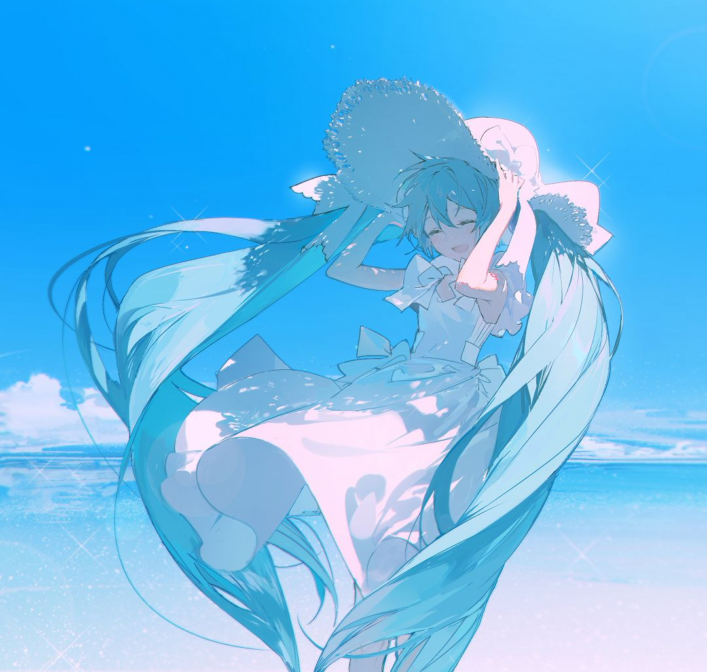

<h1 align="center"><i>"Non est ad astra mollis e terris via."</i></h1>

<a href="https://www.pixiv.net/artworks/100191209"><a/>

Here is **Kisechan**, a junior majoring in SE at Jilin University, as well as a retired CChOer.
- ,  & .
- Interested in Embodied Intelligence and Reinforcement Learning.
- Curious about Building Full-Stack Applications.
- ACGN Fan.

### Tools & Tech-Stacks :movie_camera:

#### Programming Languages :telescope:

<!-- Programming Languages -->

#### Toolchains & Frameworks :open_file_folder:

#### Document & Typesetting :pencil2:

<!-- LaTeX, Typst and Markdown -->

#### IDEs, Services & OSes :milky_way:

## Programming :speech_balloon:

<!-- 

  

 -->

<a href="https://github-readme-stats.kisechan.space/">

  
  

<a/>

## Blog Posts :fire:

Here are my latest [blog](https://blog.kisechan.space/) posts:

<!-- BLOG-POST-LIST:START --><li> 💎 <a href="https://blog.kisechan.space/2026/Apuntes-de-espanol-semana-2/">Apuntes de español, semana 2</a> | 🗓 <b>2026-03-19</b> </li>
<li> 🎀 <a href="https://blog.kisechan.space/2026/Apuntes-de-espan%CC%83ol-semana-1/">Apuntes de español, semana 1</a> | 🗓 <b>2026-03-16</b> </li>
<li> 🎀 <a href="https://blog.kisechan.space/2026/kashi-emojilize/">给你的歌词加上 Emoji！</a> | 🗓 <b>2026-02-12</b> </li>
<li> 🎈 <a href="https://blog.kisechan.space/2026/nosql/">NoSQL 的学习使用和环境配置</a> | 🗓 <b>2026-02-11</b> </li>
<li> 🎁 <a href="https://blog.kisechan.space/2025/how-to-use-git/">Git 团队合作的简单使用教程</a> | 🗓 <b>2025-12-31</b> </li>
<!-- BLOG-POST-LIST:END -->

## Reach Me :loudspeaker:

**Email**
- :email: [*kisechan_* **[at]** *outlook.com*](mailto:&#107;&#105;&#115;&#101;&#99;&#104;&#97;&#110;&#95;&#64;&#111;&#117;&#116;&#108;&#111;&#111;&#107;&#46;&#99;&#111;&#109;)
- :email: [*hello* **[at]** *kisechan.space*](mailto:&#104;&#101;&#108;&#108;&#111;&#64;&#107;&#105;&#115;&#101;&#99;&#104;&#97;&#110;&#46;&#115;&#112;&#97;&#99;&#101;)

---

<a href="https://count.getloli.com/">

  

<a/>
